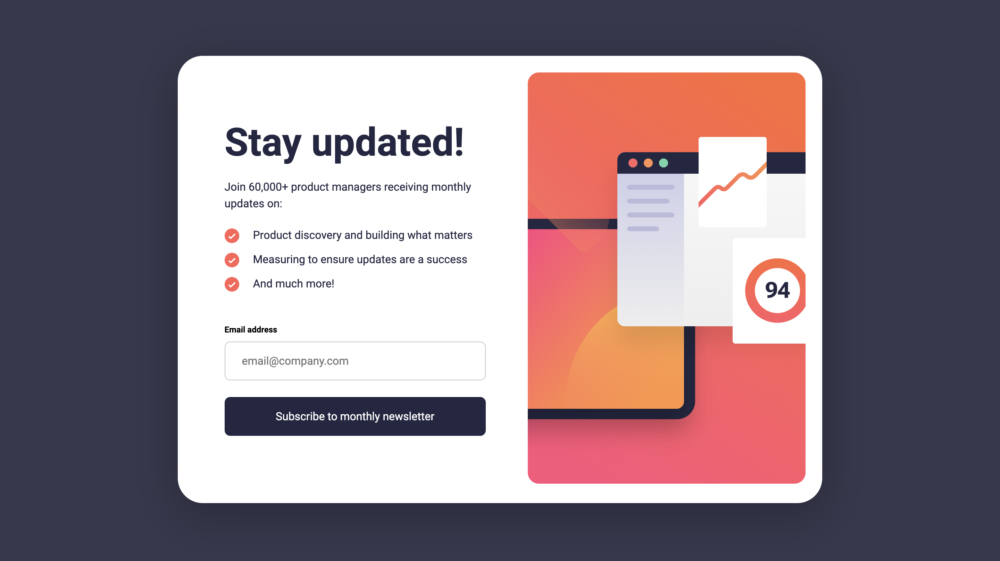

# Frontend Mentor - Newsletter sign-up form with success message solution

This is a solution to the [Newsletter sign-up form with success message challenge on Frontend Mentor](https://www.frontendmentor.io/challenges/newsletter-signup-form-with-success-message-3FC1AZbNrv). Frontend Mentor challenges help you improve your coding skills by building realistic projects. 

## Table of contents

  - [The challenge](#the-challenge)
  - [Screenshot](#screenshot)
  - [Links](#links)
- [My process](#my-process)
  - [Built with](#built-with)
  - [What I learned](#what-i-learned)
  - [Continued development](#continued-development)
- [Author](#author)

### The challenge

Users should be able to:

- Add their email and submit the form
- See a success message with their email after successfully submitting the form
- See form validation messages if:
  - The field is left empty
  - The email address is not formatted correctly
- View the optimal layout for the interface depending on their device's screen size
- See hover and focus states for all interactive elements on the page

### Screenshot

### Links

- Solution URL: [Repository](https://github.com/DAJ350/newsletter-sign-up-with-success-message-main)
- Live Site URL: [Git Page](https://daj350.github.io/newsletter-sign-up-with-success-message-main/)

## My process

I started off with creating the structure of the page with semantic HTML 5.

I then went on to create the custom properties in CSS. 

I then began styling the desktop version of the page. 

After the desktop versions were created, I went on to set up the form validation with JavaScript. 

After setting up the form validation, I went ahead to set up the system used to transfer data from one page over to another in order to achieve the intended design from the figma design file. 

After finishing creating the interactivity with JavaScript, I went ahead to complete the mobile desgin for the pages. 

### Built with

- Semantic HTML5 markup
- CSS custom properties
- Flexbox
- BEM
- JavaScript 

### What I learned

I learnt quite a bit with this project. I revisited the `.match()` method. I used this to check that the value of the email input element was not falsy `null` when checked against a regular expression / regex pattern.

Following from this, I also came across the `.test()` method. I will need some practice with this method to gain a clearer understanding of how it works.

Learning about the `.match()` and `.test()` methods also helped me realise that regex patterns must start and end with a forward slash `/` to indicate the start and ending of a regular expression.

Lastly, to figure out how to transfer data from one page to another using JavaScript, I leaned about the `localStorage` and `sessionStorage` objects that is used to save data which can later be retrieved after a page load. 

### Continued development

I would like to practice more with using a mixture of HTML, CSS and JavaScript to create frontend projects that require JavaScript form validation logic as well as the transfer of data across multiple pages. 

## Author

- Github - [DAJ350](https://github.com/DAJ350)
- Frontend Mentor - [@DAJ350](https://www.frontendmentor.io/profile/DAJ350)
